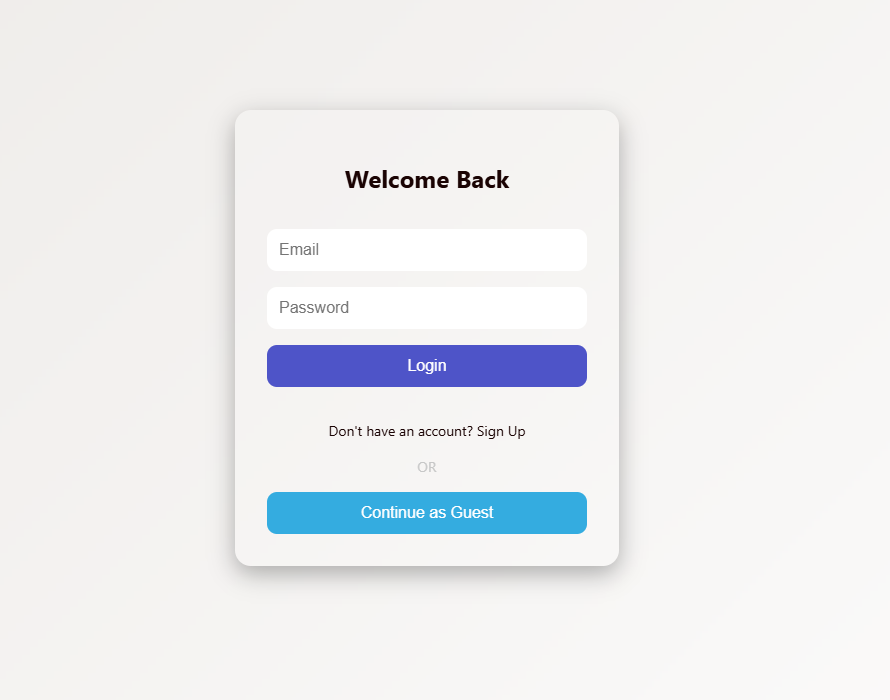
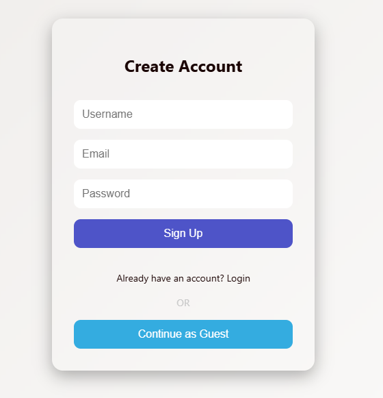
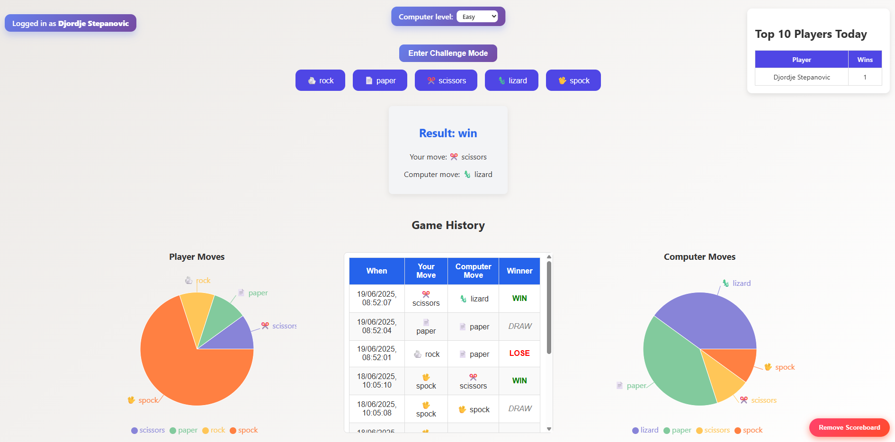
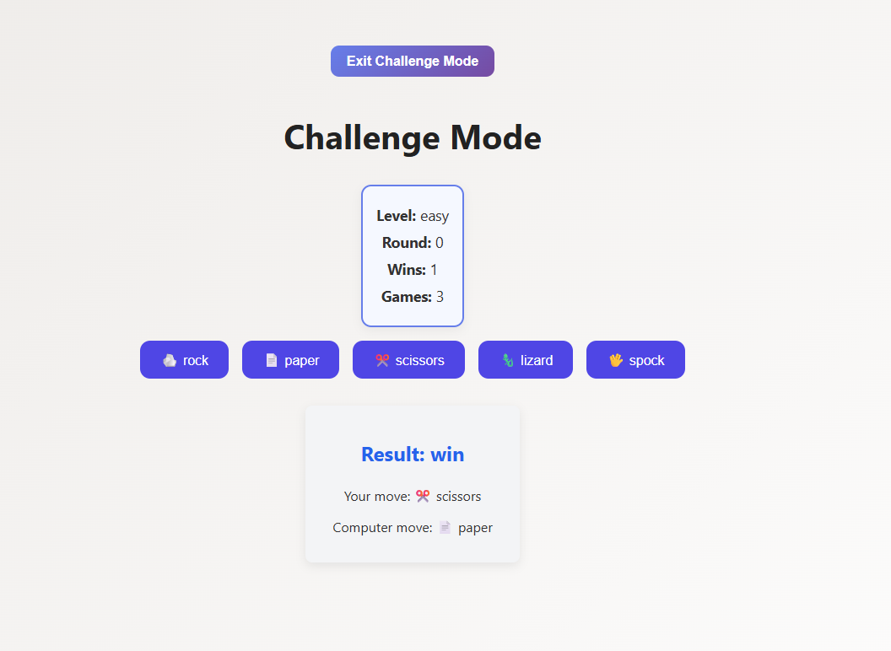

# RPSLS Game Project

This project includes a backend (FastAPI), frontend (React), Redis and a PostgreSQL database, all orchestrated via Docker Compose.

---

## Project Structure

- `rpsls_game_api/` - Backend API (FastAPI)  
- `rpsls_game_frontend/` - Frontend (React)  
- `docker-compose.yaml` - Orchestrates the entire system (database, API, frontend)

---

## Setup Instructions

1. **Clone the repository:**

```bash
git clone https://github.com/stepa997/rpsls_game.git
cd rpsls_game
```

2. **Create a `.env` file in the root directory (same level as docker-compose.yaml) with the following content:**

```bash
DB_USER is database username for connecting to PostgreSQL.
DB_PASSWORD is password for the database user.
DB_HOST is host address of the PostgreSQL server (e.g., localhost or Docker service name)
DB_NAME is name of the database to connect to
DB_PORT is the port your local machine uses to connect to the PostgreSQL container
API_PORT is the port on which the FastAPI backend will be exposed
FRONTEND_PORT is the port on which the React frontend will be exposed
REDIS_HOST is host addres of the Redis server (e.g., localhost or Docker service name)
REDIS_PORT is the port your local machine uses to connect to the Redis container
```

3. **Start the project with Docker Compose:**

```bash
docker-compose up -d --build
```
This command will build and start the PostgreSQL database, the Redis memory storage, the FastAPI backend, and the React frontend in separate Docker containers.

## Access the application
Backend API: http://localhost:${API_PORT}

Frontend UI: http://localhost:${FRONTEND_PORT}

### 📜 Game Rules

The game is based on the extended version of Rock-Paper-Scissors:
**Rock-Paper-Scissors-Lizard-Spock**

- Rock crushes Scissors and Lizard  
- Paper covers Rock and disproves Spock  
- Scissors cuts Paper and decapitates Lizard  
- Lizard eats Paper and poisons Spock  
- Spock smashes Scissors and vaporizes Rock

A random choice is selected by the server, and the player tries to outsmart it.

## 🎮 Gameplay

### 🔐 Authentication

Upon launching the app, the user is offered three options:
- **Sign Up** – Create an account with a username, email, and password
- **Login** – Access the app using existing credentials
- **Continue as Guest** – Play instantly without registration (temporary session)

The user can switch between **Login** and **Sign Up** views by clicking the corresponding text links at the bottom of each form.

**Login screen:**



**Sign Up screen:**



### 🧭 Main Menu

Once authenticated, the user enters the main menu with the following options:
- **Classic Mode**
- **Challenge Mode**
- **Scoreboard**
- **Remove Scoreboard**



### 🕹️ Playing the Game

1. Choose your move: Rock, Paper, Scissors, Lizard, or Spock
2. The server returns its move
3. The result is displayed with a visual indicator (Win/Loss/Draw)

### 📊 Scoreboard & History

Each game result is recorded and displayed in the history table.  
The scoreboard shows:
- Date & time of the match
- Player and opponent choices
- Outcome (Win/Loss/Draw)

A pie chart visualizes the overall performance.

### 🏆 Challenge Mode

Challenge Mode adds a competitive layer to the game:
- 3 Rounds × 10 Matches each
- Player must win at least **5 matches per round** to continue
- Progress is tracked and stored in the database

After completing a challenge, results are shown with a summary.



### 🧹 Remove Scoreboard

A "Remove Scoreboard" button allows the user to delete all stored results.  
A confirmation popup ensures the user does not delete data by accident.

## Additional Information
The database will be initialized automatically on the first run.

Backend and frontend communicate via Docker internal networking.

## License & Contact
Feel free to use and modify this project.
For questions, reach out via `djolestepa997@gmail` or GitHub profile `stepa997`.

